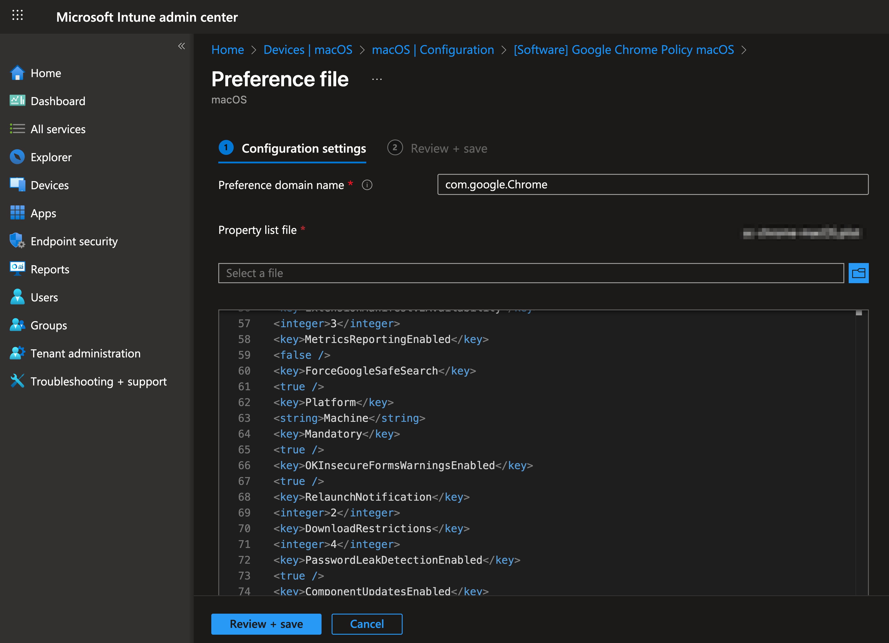
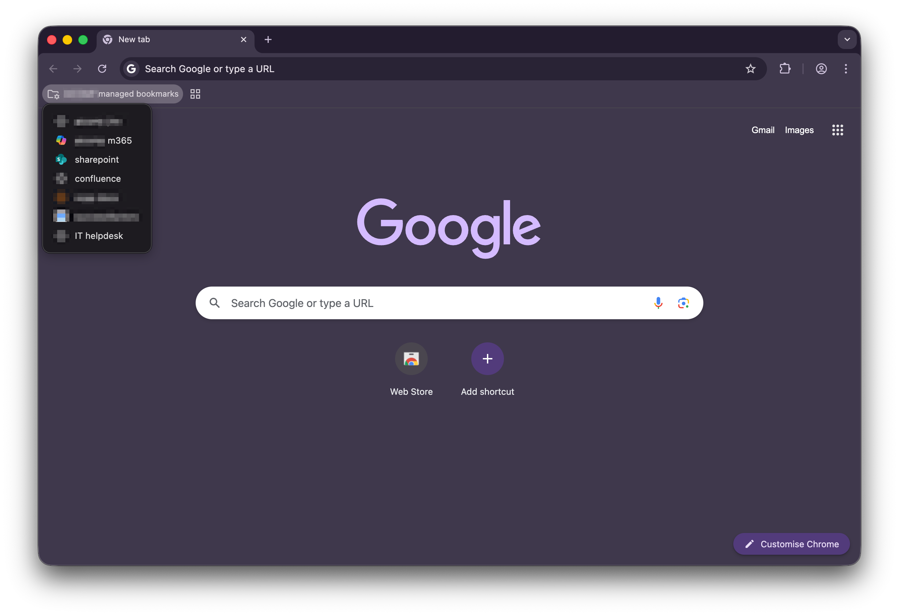
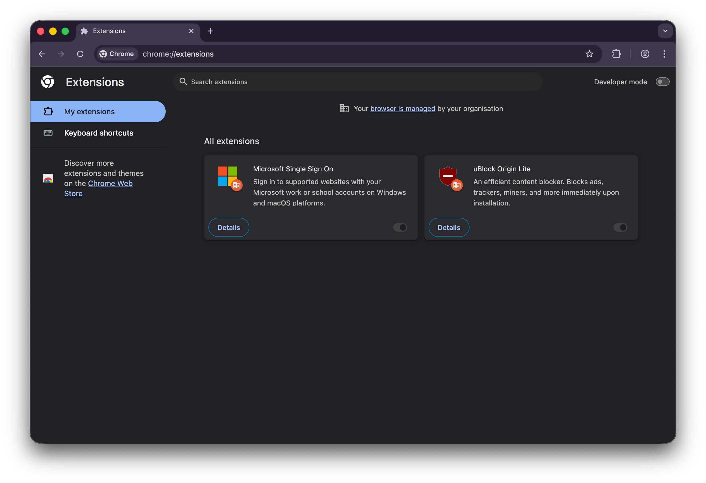

# Browser policy files for Intune

This repository contains policy files for managing **Chrome** and **Firefox** browsers on **macOS** and **Windows** in an enterprise environment using **Intune**.
## 🚀 Features

- Deployment of custom managed bookmarks
- Configuration of update behavior
- Setting **Google** as the default search engine in **Edge**
- Hiding first-run dialogs for end users
- Deployment of predefined extensions (e.g., **uBlock Origin Lite**)
- Deployment of the **Microsoft SSO extension** for Chrome on macOS to enable seamless SSO with **Entra ID**
- Configuration of **EntraSSO** in Firefox using [Mozilla Policy Templates](https://mozilla.github.io/policy-templates/#microsoftentrasso)
#### Other Enforced Settings

- Google SafeSearch enabled
- Updates enforced
- Password leak detection enabled
- Component updates enabled
- Download restrictions for dangerous files
---
## Recent Changes

- **Sep 2025** – Updated to _uBlock Origin Lite_ (Manifest V3 compatible).
---
## Configure Extensions
The easiest way to get the **extension ID** is directly from the **Chrome Web Store** or **Firefox Add-ons** URL:
### Chrome / Edge
Example Chrome Web Store URL:
`https://chrome.google.com/webstore/detail/ublock-origin-lite/odfafepnkmbhccpbejgmiehpchacaeak`
- **Extension ID** → `odfafepnkmbhccpbejgmiehpchacaeak`
- **Update URL** → `https://clients2.google.com/service/update2/crx`

Add these as entries in the `ExtensionInstallForcelist` array of your policy.
---
### Firefox
For Firefox, map `<key>install_url</key>` to a valid download location:
- From **addons.mozilla.org (AMO)**:
    `https://addons.mozilla.org/firefox/downloads/latest/EXTENSION_ID/latest.xpi`
- From the **local file system**:
    `file:///path/to/extension.xpi`
- If you require Language packs:
`https://releases.mozilla.org/pub/firefox/releases/VERSION/PLATFORM/xpi/LANGUAGE.xpi`

[Mozilla policy docs](https://mozilla.github.io/policy-templates/#extensionsettings)

--- 
# Deployment with Intune
## macOS
 
On macOS, browsers are managed using local **plist** configuration files. These are write-protected by Intune by default and can be applied system-wide. Files can be found at `/Library/Managed Preferences`

### Deployment with Intune
1. Create a configuration profile:  
    **Profile → Templates → Preferences File**
2. Upload the `policy.plist` file
3. Set the **Preference domain name** to the **BundleID** of the browser (e.g., `com.google.Chrome`)

Find the BundleID:
`codesign -dv /path/to/application/`

---

## Windows

On Windows, browser management is configured using **Intune**.  
Configuration profiles can be downloaded as **JSON templates** and imported into Intune.

Settings are largely aligned with the macOS counterpart.

# Result 

